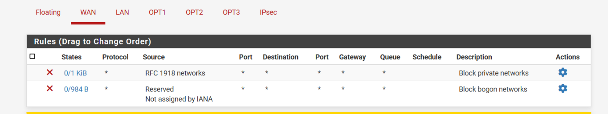
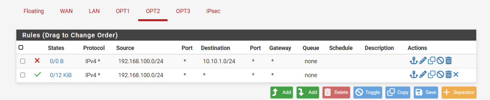
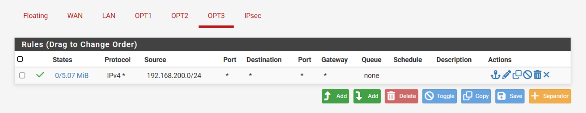
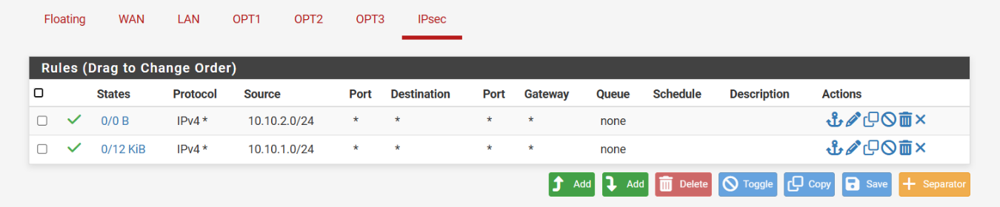

# Indicateurs : 

## Supervisions :

Via Grafana / Prometheus 

###  Indicateurs supervisés

- Charge CPU
- Utilisation mémoire 
- Utilisation disque
- Trafic réseau
- Uptime machine
- Interface SNMP (em2.20) trafic entrant/sortant (pfSense)
- Services disponibles via ports listés plus bas

###  Services

- node_exporter
- telegraf
- prometheus
- grafana-server
- apache2
- snmpd
- pfsense 

### Ports 

- 9100 
- 9273 
- 9090 
- 3000 
- 80 
- 161/UDP

### Proc

- apache2
- mysqld
- node_exporter
- telegraf
- prometheus
- grafana-server

### IP

- IP Nextcloud (ex: 10.10.2.4)
- IP TeamPass (ex: 10.10.1.5)
- IP pfSense (ex: 192.168.200.1)
- IP machine supervision (Prometheus + Grafana)

## Règles pare feu : 






## Monitorer le pfsense : 

Monitoring via telegraf, extrès d'une conf : 

```Bash
[[inputs.snmp]]
  agents = ["udp://192.168.200.1:161"]
  version = 2
  community = "public"
  name = "pfsense"

  [[inputs.snmp.field]]
    name = "pfsense_mem_used"
    oid = "UCD-SNMP-MIB::memUsed.0"

  [[inputs.snmp.field]]
    name = "pfsense_cpu_user"
    oid = "UCD-SNMP-MIB::ssCpuUser.0"

[[outputs.prometheus_client]]
  listen = "0.0.0.0:9273"
```

