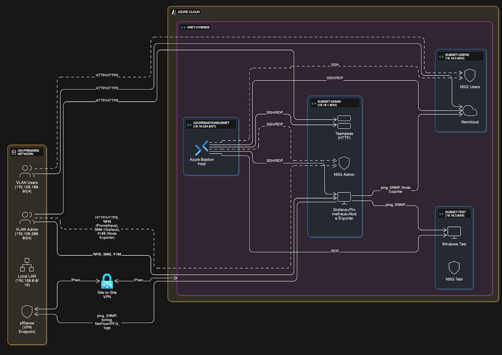
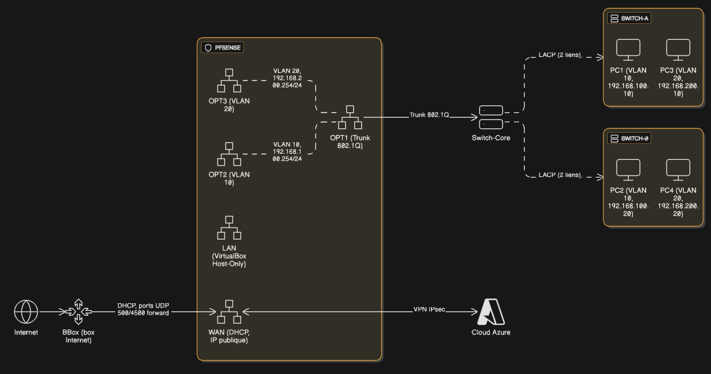
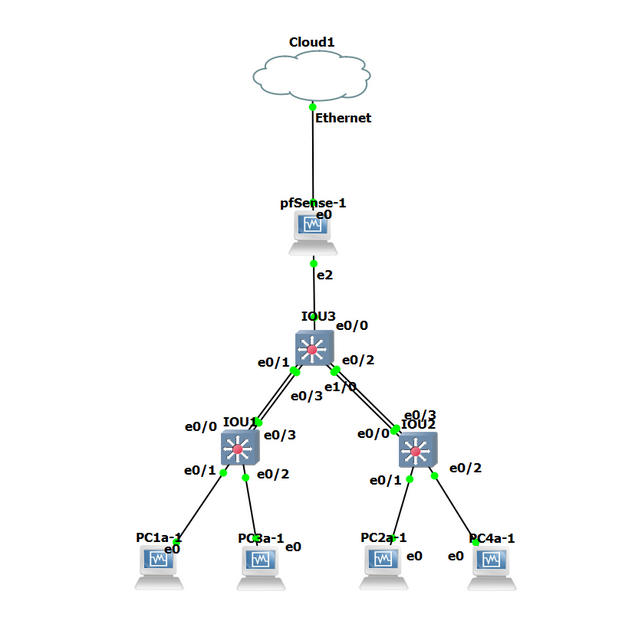

# Install 

## Applicatif : 

### Teampass  

```Bash
sudo apt-get update && sudo apt-get install -y apache2 mariadb-server php libapache2-mod-php php-mysql php-curl php-mbstring php-bcmath php-gd php-xml wget unzip

cd /var/www/html
sudo wget https://github.com/nilsteampassnet/TeamPass/archive/refs/tags/3.1.4.26.zip -O teampass.zip
sudo unzip teampass.zip && sudo mv TeamPass-3.1.4.26 teampass
sudo chown -R www-data:www-data /var/www/html/teampass

sudo mysql -e "CREATE DATABASE teampass CHARACTER SET utf8mb4 COLLATE utf8mb4_general_ci;"
sudo mysql -e "CREATE USER 'teampass'@'localhost' IDENTIFIED BY 'Aze+123@.';"
sudo mysql -e "GRANT ALL PRIVILEGES ON teampass.* TO 'teampass'@'localhost'; FLUSH PRIVILEGES;"

sudo a2enmod rewrite
sudo tee /etc/apache2/sites-available/teampass.conf > /dev/null <<'EOF'
<VirtualHost *:80>
    ServerName monserveur.example.com
    DocumentRoot /var/www/html/teampass
    <Directory /var/www/html/teampass>
        Options FollowSymlinks
        AllowOverride All
        Require all granted
    </Directory>
</VirtualHost>
EOF
sudo a2ensite teampass.conf && sudo systemctl reload apache2

sudo systemctl enable apache2
sudo systemctl enable mariadb
```

### Grafana :3000, Prometheus :9100

```Bash
sudo apt-get update && sudo apt-get install -y prometheus prometheus-node-exporter

sudo systemctl start prometheus prometheus-node-exporter
sudo systemctl enable prometheus prometheus-node-exporter

sudo apt-get install -y apt-transport-https software-properties-common wget
sudo mkdir -p /etc/apt/keyrings 
wget -q -O - https://apt.grafana.com/gpg.key | sudo gpg --dearmor -o /etc/apt/keyrings/grafana.gpg
echo "deb [signed-by=/etc/apt/keyrings/grafana.gpg] https://apt.grafana.com stable main" | sudo tee /etc/apt/sources.list.d/grafana.list
sudo apt-get update && sudo apt-get install -y grafana

sudo systemctl start grafana-server
sudo systemctl enable grafana-server
```

### Nextcloud

```Bash
sudo apt update && sudo apt upgrade -y
sudo apt install apache2 mariadb-server libapache2-mod-php php php-mysql php-gd php-json php-xml php-curl php-zip php-mbstring php-intl php-bcmath unzip wget curl -y

wget https://download.nextcloud.com/server/releases/latest.zip
unzip latest.zip
sudo mv nextcloud /var/www/
sudo chown -R www-data:www-data /var/www/nextcloud
sudo chmod -R 755 /var/www/nextcloud

sudo tee /etc/apache2/sites-available/nextcloud.conf > /dev/null <<EOF
<VirtualHost *:80>
    ServerAdmin webmaster@localhost
    DocumentRoot /var/www/nextcloud
    ServerName nextcloud.local

    <Directory /var/www/nextcloud/>
        Options +FollowSymlinks
        AllowOverride All
        Require all granted
    </Directory>

    ErrorLog \${APACHE_LOG_DIR}/nextcloud_error.log
    CustomLog \${APACHE_LOG_DIR}/nextcloud_access.log combined
</VirtualHost>
EOF

sudo a2ensite nextcloud.conf
sudo a2dissite 000-default.conf
sudo a2enmod rewrite headers env dir mime
sudo systemctl restart apache2

sudo mysql -u root -p

CREATE DATABASE nextcloud;
CREATE USER 'ncuser'@'localhost' IDENTIFIED BY 'motdepassefort';
GRANT ALL PRIVILEGES ON nextcloud.* TO 'ncuser'@'localhost';
FLUSH PRIVILEGES;
EXIT;

cd /var/www/nextcloud
sudo -u www-data php occ user:resetpassword nom_utilisateur
sudo -u www-data php occ user:add nom_utilisateur
sudo -u www-data php occ group:add nom_groupe
sudo -u www-data php occ group:adduser nom_groupe nom_utilisateur
sudo -u www-data php occ group:adduser admin nom_utilisateur
sudo -u www-data php occ user:list
sudo -u www-data php occ app:enable groupfolders
sudo -u www-data php occ groupfolders:create "NomDuDossier"
sudo -u www-data php occ groupfolders:create "COMMUN"
sudo -u www-data php occ groupfolders:group 1 groupe_nom write
sudo -u www-data php occ groupfolders:group 1 Employes write
sudo -u www-data php occ groupfolders:group 1 IT write
sudo -u www-data php occ groupfolders:quota 1 5GB
sudo -u www-data php occ groupfolders:permissions 1 -- group Employes read create
```

## Réseau côté CLOUD :


#### Schéma cloud
Via Terraform, voir dans le repo

## Réseau côté LAN : 


#### Schéma LAN

#### Schéma GNS 3

#### IOU1 :
```cisco
IOU1#sh run
Building configuration...

Current configuration : 1905 bytes
!
! Last configuration change at 21:43:32 UTC Tue Jul 8 2025
!
version 15.2
service timestamps debug datetime msec
service timestamps log datetime msec
no service password-encryption
service compress-config
!
hostname IOU1
!
boot-start-marker
boot-end-marker
!
!
logging discriminator EXCESS severity drops 6 msg-body drops EXCESSCOLL
logging buffered 50000
logging console discriminator EXCESS
!
no aaa new-model
!
!
!
!
!
no ip icmp rate-limit unreachable
!
!
!
no ip domain-lookup
no ip cef
no ipv6 cef
!
!
!
spanning-tree mode pvst
spanning-tree extend system-id
!
!
!
!
!
!
!
!
!
!
!
!
!
!
!
interface Port-channel1
 switchport trunk allowed vlan 10,20
 switchport trunk encapsulation dot1q
 switchport mode trunk
!
interface Ethernet0/0
 switchport trunk allowed vlan 10,20
 switchport trunk encapsulation dot1q
 switchport mode trunk
 channel-group 1 mode active
!
interface Ethernet0/1
 switchport access vlan 10
 switchport mode access
!
interface Ethernet0/2
 switchport access vlan 20
 switchport mode access
!
interface Ethernet0/3
 switchport trunk allowed vlan 10,20
 switchport trunk encapsulation dot1q
 switchport mode trunk
 channel-group 1 mode active
!
interface Ethernet1/0
!
interface Ethernet1/1
!
interface Ethernet1/2
!
interface Ethernet1/3
!
interface Ethernet2/0
!
interface Ethernet2/1
!
interface Ethernet2/2
!
interface Ethernet2/3
!
interface Ethernet3/0
!
interface Ethernet3/1
!
interface Ethernet3/2
!
interface Ethernet3/3
!
interface Vlan1
 no ip address
 shutdown
!
ip forward-protocol nd
!
ip tcp synwait-time 5
ip http server
!
ip ssh server algorithm encryption aes128-ctr aes192-ctr aes256-ctr
ip ssh client algorithm encryption aes128-ctr aes192-ctr aes256-ctr
!
!
!
!
!
control-plane
!
!
line con 0
 exec-timeout 0 0
 privilege level 15
 logging synchronous
line aux 0
 exec-timeout 0 0
 privilege level 15
 logging synchronous
line vty 0 4
 login
!
!
!
end
```

#### IOU2 :
```cisco
IOU2#sh run
Building configuration...

Current configuration : 1905 bytes
!
! Last configuration change at 21:43:32 UTC Tue Jul 8 2025
!
version 15.2
service timestamps debug datetime msec
service timestamps log datetime msec
no service password-encryption
service compress-config
!
hostname IOU2
!
boot-start-marker
boot-end-marker
!
!
logging discriminator EXCESS severity drops 6 msg-body drops EXCESSCOLL
logging buffered 50000
logging console discriminator EXCESS
!
no aaa new-model
!
!
!
!
!
no ip icmp rate-limit unreachable
!
!
!
no ip domain-lookup
no ip cef
no ipv6 cef
!
!
!
spanning-tree mode pvst
spanning-tree extend system-id
!
!
!
!
!
!
!
!
!
!
!
!
!
!
!
interface Port-channel2
 switchport trunk allowed vlan 10,20
 switchport trunk encapsulation dot1q
 switchport mode trunk
!
interface Ethernet0/0
 switchport trunk allowed vlan 10,20
 switchport trunk encapsulation dot1q
 switchport mode trunk
 channel-group 2 mode active
!
interface Ethernet0/1
 switchport access vlan 10
 switchport mode access
!
interface Ethernet0/2
 switchport access vlan 20
 switchport mode access
!
interface Ethernet0/3
 switchport trunk allowed vlan 10,20
 switchport trunk encapsulation dot1q
 switchport mode trunk
 channel-group 2 mode active
!
interface Ethernet1/0
!
interface Ethernet1/1
!
interface Ethernet1/2
!
interface Ethernet1/3
!
interface Ethernet2/0
!
interface Ethernet2/1
!
interface Ethernet2/2
!
interface Ethernet2/3
!
interface Ethernet3/0
!
interface Ethernet3/1
!
interface Ethernet3/2
!
interface Ethernet3/3
!
interface Vlan1
 no ip address
 shutdown
!
ip forward-protocol nd
!
ip tcp synwait-time 5
ip http server
!
ip ssh server algorithm encryption aes128-ctr aes192-ctr aes256-ctr
ip ssh client algorithm encryption aes128-ctr aes192-ctr aes256-ctr
!
!
!
!
!
control-plane
!
!
line con 0
 exec-timeout 0 0
 privilege level 15
 logging synchronous
line aux 0
 exec-timeout 0 0
 privilege level 15
 logging synchronous
line vty 0 4
 login
!
!
!
end
```

#### IOU3 : 
```cisco
IOU3#sh run
Building configuration...

Current configuration : 2367 bytes
!
! Last configuration change at 21:43:32 UTC Tue Jul 8 2025
!
version 15.2
service timestamps debug datetime msec
service timestamps log datetime msec
no service password-encryption
service compress-config
!
hostname IOU3
!
boot-start-marker
boot-end-marker
!
!
logging discriminator EXCESS severity drops 6 msg-body drops EXCESSCOLL
logging buffered 50000
logging console discriminator EXCESS
!
no aaa new-model
!
!
!
!
!
no ip icmp rate-limit unreachable
!
!
!
no ip domain-lookup
no ip cef
no ipv6 cef
!
!
!
spanning-tree mode pvst
spanning-tree extend system-id
!
!
!
!
!
!
!
!
!
!
!
!
!
!
!
interface Port-channel1
 switchport trunk allowed vlan 10,20
 switchport trunk encapsulation dot1q
 switchport mode trunk
!
interface Port-channel2
 switchport trunk allowed vlan 10,20
 switchport trunk encapsulation dot1q
 switchport mode trunk
!
interface Ethernet0/0
 switchport trunk allowed vlan 10,20
 switchport trunk encapsulation dot1q
 switchport mode trunk
!
interface Ethernet0/1
 switchport trunk allowed vlan 10,20
 switchport trunk encapsulation dot1q
 switchport mode trunk
 channel-group 1 mode active
!
interface Ethernet0/2
 switchport trunk allowed vlan 10,20
 switchport trunk encapsulation dot1q
 switchport mode trunk
 channel-group 2 mode active
!
interface Ethernet0/3
 switchport trunk allowed vlan 10,20
 switchport trunk encapsulation dot1q
 switchport mode trunk
 channel-group 1 mode active
!
interface Ethernet1/0
 switchport trunk allowed vlan 10,20
 switchport trunk encapsulation dot1q
 switchport mode trunk
 channel-group 2 mode active
!
interface Ethernet1/1
!
interface Ethernet1/2
!
interface Ethernet1/3
!
interface Ethernet2/0
!
interface Ethernet2/1
!
interface Ethernet2/2
!
interface Ethernet2/3
!
interface Ethernet3/0
!
interface Ethernet3/1
!
interface Ethernet3/2
!
interface Ethernet3/3
!
interface Vlan1
 no ip address
 shutdown
!
interface Vlan10
 no ip address
 shutdown
!
interface Vlan20
 no ip address
 shutdown
!
ip forward-protocol nd
!
ip tcp synwait-time 5
ip http server
!
ip ssh server algorithm encryption aes128-ctr aes192-ctr aes256-ctr
ip ssh client algorithm encryption aes128-ctr aes192-ctr aes256-ctr
!
!
!
!
!
control-plane
!
!
line con 0
 exec-timeout 0 0
 privilege level 15
 logging synchronous
line aux 0
 exec-timeout 0 0
 privilege level 15
 logging synchronous
line vty 0 4
 login
!
!
!
end
```
### Pfsense & Screen install VPN (Lan)

```bash
sudo apt update && sudo apt upgrade -y
sudo apt install qemu-kvm libvirt-daemon-system virtinst bridge-utils -y
wget https://atxfiles.netgate.com/mirror/downloads/pfSense-CE-2.7.2-RELEASE-amd64.iso.gz
gunzip pfSense-CE-2.7.2-RELEASE-amd64.iso.gz
qemu-img create -f qcow2 pfsense.qcow2 8G
virt-install \
  --name pfsense \
  --ram 2048 \
  --vcpus 2 \
  --os-type unix \
  --os-variant generic \
  --cdrom=pfSense-CE-2.7.2-RELEASE-amd64.iso \
  --disk path=pfsense.qcow2,format=qcow2 \
  --network bridge=virbr0 \
  --network bridge=virbr0 \
  --graphics vnc,listen=0.0.0.0 \
  --noautoconsole
```

